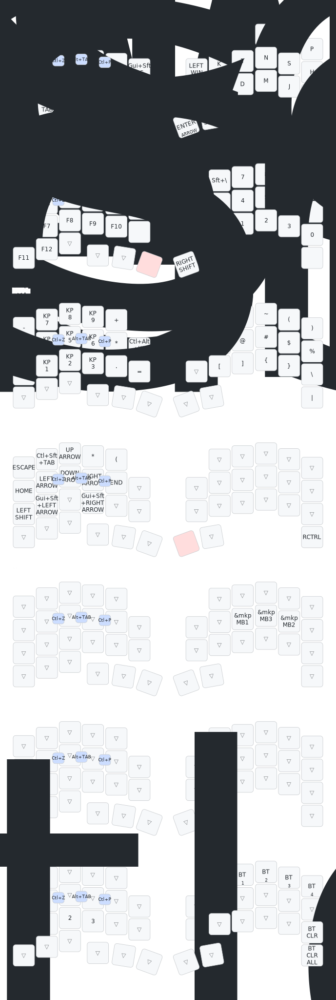

# zmk-config-roBa

・zmkのバージョンをZMK Firmware Zephyr 4.1に固定。

## キーマップ (Default Layer)

```
左手 (Left)                                             右手 (Right)
┌──────┬──────┬──────┬────────┬────────┐             ┌──────────┬───────┬──────┬──────┬──────┐
│  Q   │  L   │  U   │ Ctrl+C │ Ctrl+V │             │ Lang1/2  │  W/F  │  R   │  Y   │  P   │
├──────┼──────┼──────┼────────┼────────┼──────────┐  ├──────────┼───────┼──────┼──────┼──────┤
│ ,/.  │  I   │  A   │   O    │   -    │ W+Sft+S  │  │   Win    │   K   │  T   │  N   │  S   │  H
├──────┼──────┼──────┼────────┼────────┼──────────┤  ├──────────┼───────┼──────┼──────┼──────┤
│  Z   │  X   │  C   │   E    │   V    │ C+Sft+Esc│  │   Win    │   G   │  D   │  M   │  J   │  B
└──────┴──────┴──────┴────────┴────────┴──────────┘  └──────────┴───────┴──────┴──────┴──────┘
┌──────┬────────┬──────┬──────┬──────┬──────────┐  ┌──────────┬────────┐          ┌──────┐
│ ESC  │ Ctl/TB │ Alt  │ LSft │  BS  │  Sp/L1   │  │  Ent/L3  │ RSft   │          │ Del  │
└──────┴────────┴──────┴──────┴──────┴──────────┘  └──────────┴────────┘          └──────┘
```

- `Lang1/2` : タップ=英数、ダブルタップ=かな
- `W/F`     : タップ=W、ダブルタップ=F
- `,/.`     : タップ=,、ダブルタップ=.
- `Sp/L1`   : タップ=Space、ホールド=FUNCTION レイヤー
- `Ent/L3`  : タップ=Enter、ホールド=ARROW レイヤー
- `Ctl/TB`  : タップ=Tab、ホールド=Ctrl


